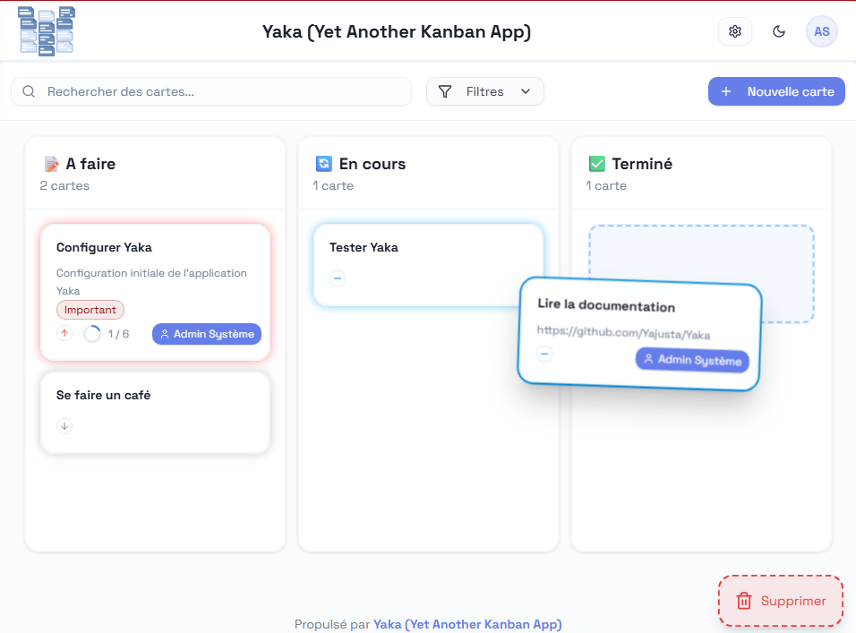
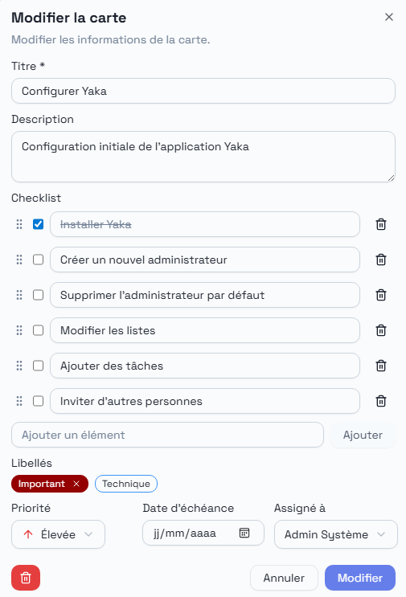

# YAKA - Yet Another Kanban App

**FRANÇAIS** - [ENGLISH](README.md)


Une application web moderne et intuitive pour la gestion collaborative de tâches utilisant la méthodologie Kanban.

NOUVEAU : **Pilotage par la voix**
Gérez vos tâches avec la voix en langage naturel grâce au pouvoir de l'IA.

## 🖼️ Captures d'écran





## 🖥️ Démo

Pour voir à quoi ressemble cette application avant de l'installer, le plus simple est d'aller tester [la démo](https://yaka-demo.yajusta.fr/).

Identifiant : `admin@yaka.local`
Mot de passe : `Admin123`

🗑️ La base est supprimée régulièrement.
⚠️ L'environnement est public : ne mettez pas d'informations sensibles.
L'envoie des emails d'invation est désactivé.

## ⚙️ Fonctionnalités

- **Tableau Kanban interactif**
- **Gestion des tâches à la voix grâce à l'IA**
- **Drag & Drop** fluide pour déplacer les cartes
- **Authentification sécurisée** avec JWT
- **Cartes détaillées** avec titre, description, liste d'éléments, priorité, assigné, libellés, date d'échéance, commentaires
- **Recherche et filtres**
- **Utilisateurs illimités**
- **Gestion des rôles** (administrateur / membre)
- **Gestion des colonnes** pour mettre autant de colonnes que nécessaire
- **Gestion des libellés** colorés pour la catégorisation
- **Historisation des évènements** pour suivre qui a fait quoi
- **Gestion des archives** pour ne jamais rien perdre

## 📝 Changelog

[Changelog](CHANGELOG.md)

## 🚀 Déploiement

La méthode la plus simple pour utiliser Yaka sans se prendre la tête.

### 1. Cloner le projet

```bash
git clone https://github.com/Yajusta/Yaka.git
cd Yaka
```

### 2. Modifier les variables d'environnement

```bash
cp .env.sample .env
```

Puis modifier les variables d'environnement nécessaires.

`JWT_SECRET` est **obligatoire** : le backend refuse de démarrer (et `docker compose` s'arrête) s'il est absent ou fait moins de 32 caractères. Pour en générer un :

```bash
openssl rand -hex 32
```

`YAKA_ADMIN_API_KEY` est optionnelle : la laisser vide pour désactiver les endpoints `/admin`, ou lui donner une valeur aléatoire d'au moins 32 caractères (même commande).

`API_BASE_URL` doit être l'URL absolue du backend telle que la voient les navigateurs (`https://api.example.com`) : son origine est ajoutée à la Content-Security-Policy des frontends, toute autre origine est bloquée. Toutes les variables sont listées dans [Variables d'environnement](#-variables-denvironnement).

### 3. Donner le répertoire de données à l'utilisateur du conteneur

Le conteneur backend tourne sous l'uid non privilégié `10001` et `./data/` y est monté en bind. Ce répertoire (et son contenu) doit appartenir à cet uid, sinon SQLite ouvre les bases des tableaux en lecture seule et toute écriture échoue avec `sqlite3.OperationalError: attempt to write a readonly database`.

```bash
mkdir -p data
sudo chown -R 10001:10001 data/
```

Le répertoire compte autant que les fichiers `.db` : SQLite y écrit les fichiers `-journal`/`-wal`, et la création d'un nouveau tableau crée un nouveau fichier.

### 4. Déployer avec Docker

```bash
docker compose build
docker compose up -d
```

La construction nécessite BuildKit (activé par défaut depuis Docker 23 et avec `docker compose` v2).

Au premier démarrage, sauf si `DEFAULT_ADMIN_PASSWORD` est défini, le mot de passe de l'administrateur initial est affiché **une seule fois** dans les logs du backend, et doit être changé à la première connexion :

```bash
docker compose logs backend | grep "Administrateur initial"
```

Les scripts de maintenance se lancent dans le conteneur avec `python` (et non `uv run` : l'environnement virtuel est en lecture seule) :

```bash
docker compose exec backend python scripts/create_board.py <board_uid> [admin_email]
```

### 5. Mettre à jour une instance existante

Lire la section **Breaking changes** du [changelog](CHANGELOG.md) avant de mettre à jour : la version 1.6.0 exige `JWT_SECRET` et le `chown` de l'étape 3, et déconnecte tous les utilisateurs.

```bash
docker compose down
docker compose build
docker compose up -d
```

TODO : Faire une image Docker publique qui ne nécessitera pas de cloner le projet.

## 📦 Installation et démarrage

Si vous souhaitez le lancer à la main, c'est possible aussi.

### 📋 Prérequis

- [Python](https://www.python.org/downloads/) 3.12+ + [uv](https://docs.astral.sh/uv/)
- [Node.js](https://nodejs.org/fr/download) 18+
- [pnpm](https://pnpm.io/) (recommandé) ou [npm](https://www.npmjs.com/)

### 1. Cloner le projet

```bash
git clone https://github.com/Yajusta/Yaka.git
cd Yaka
```

### 2. Configuration du serveur de mail

Copier / coller le fichier `.env.sample` en `.env` et remplir les paramètres de configuration de votre serveur SMTP/

Exemple :

```txt
## Paramètres pour l'envoi de mail
SMTP_HOST = "smtp.resend.com"
SMTP_PORT = 587
SMTP_USER = "resend"
SMTP_PASS = "re_xxxxxxxxxxxx"
# values: 'ssl'|'starttls'|'none'
SMTP_SECURE = "starttls"
SMTP_FROM = "no-reply@domain.com"
```

Définir aussi `JWT_SECRET` (obligatoire, au moins 32 caractères, par exemple `openssl rand -hex 32`) : le backend ne démarre pas sans.

### 3. (optionel) Configuration du point d'accès IA

Le modèle LLM qui sera utilisé pour analyser les demandes faites en langage naturel.
Laisser vide pour désactiver la fonctionnalité.

```txt
## AI features (leave empty to disable)
OPENAI_API_KEY=sk-proj-bim-bam-boum
OPENAI_API_BASE_URL=https://api.openai.com/v1
LLM_MODEL=gpt-5-nano
MODEL_TEMPERATURE=
```

### 4. Démarrage du backend

```bash
cd backend
uv run uvicorn app.main:app --reload
```

Un environnement virtuel sera automatiquement créé avec toutes les dépendances nécessaires.
Le backend sera accessible sur <http://localhost:8000>

### 5. Démarrage du frontend

```bash
cd frontend
pnpm install
pnpm run dev
```

Le frontend sera accessible sur <http://localhost:5173>

### 6. Vérifications trunk

Pour vérifier le code avec Trunk :

```bash
cd frontend
npm run trunk -- upgrade
npm run trunk -- check --all --no-fix
```

## 👤 Compte administrateur par défaut

Un compte administrateur est créé automatiquement lors de l'initialisation :

- **Email :** `admin@yaka.local` (ou `DEFAULT_ADMIN_EMAIL`)
- **Mot de passe :** la valeur de `DEFAULT_ADMIN_PASSWORD` si elle est définie (ignorée hors mode démo s'il s'agit du mot de passe public `Admin123` ; au moins 8 caractères dont une majuscule, une minuscule et un chiffre, sinon le démarrage échoue). Sinon, un mot de passe aléatoire est généré et affiché **une seule fois** dans les logs du backend (`WARNING ... Administrateur initial créé`), et doit être changé à la première connexion : d'ici là, le compte peut seulement changer son mot de passe ou se déconnecter.

Une fois connecté, **créez un nouvel administrateur** avec votre email puis **supprimez ce compte par défaut**.

Les comptes de démonstration (`supervisor@`, `editor@`, `contributor@`, `commenter@`, `visitor@yaka.local`, mot de passe `Demo1234`) ne sont créés que si `DEMO_MODE=true`. Hors mode démo, à chaque démarrage et pour chaque board, le backend désactive ceux qui utilisent encore `Demo1234` (ou, s'ils ont été promus administrateur, réinitialise leur mot de passe comme ci-dessous) et, si `admin@yaka.local` (ou `DEFAULT_ADMIN_EMAIL`) utilise encore `Admin123`, remplace ce mot de passe par un mot de passe aléatoire affiché **une seule fois** dans la ligne de log `WARNING` (`Public default passwords detected`), à changer à la prochaine connexion.

## 🔧 Variables d'environnement

À définir dans `.env` (Docker, voir `.env.sample`) ou `backend/.env` (installation manuelle, voir `backend/.env.sample`). Une valeur vide vaut la valeur par défaut.

| Variable                                                                       | Défaut                                                                            | Description                                                                                                                                                                                  |
| ------------------------------------------------------------------------------ | --------------------------------------------------------------------------------- | -------------------------------------------------------------------------------------------------------------------------------------------------------------------------------------------- |
| `JWT_SECRET`                                                                   | — (**obligatoire**)                                                               | Clé de signature des sessions : au moins 32 caractères non blancs dont 8 distincts, sinon le backend ne démarre pas. `openssl rand -hex 32`.                                                 |
| `YAKA_ADMIN_API_KEY`                                                           | vide                                                                              | Clé (bearer) des endpoints `/admin` (gestion des boards). Vide ou de moins de 32 caractères : `/admin` répond 503.                                                                           |
| `DEFAULT_ADMIN_PASSWORD`                                                       | vide                                                                              | Mot de passe de l'administrateur initial, utilisé seulement à la création d'une base. Vide : mot de passe aléatoire affiché une seule fois dans les logs, à changer à la première connexion. |
| `DEFAULT_ADMIN_EMAIL`                                                          | `admin@yaka.local`                                                                | Email de l'administrateur initial (installation manuelle ; non transmise par `docker-compose.yaml`).                                                                                         |
| `BASE_URL` / `BASE_URL_MOBILE`                                                 | `http://localhost:3000` / `http://localhost:3001` (Docker)                        | URL publiques des frontends desktop et mobile : liens des emails, origines CORS ; l'hôte de `BASE_URL` est le seul accepté en plus de `localhost`/`127.0.0.1`.                               |
| `API_BASE_URL`                                                                 | `http://localhost:8000`                                                           | URL du backend utilisée par les navigateurs. Doit être absolue (`http(s)://hôte[:port]`) pour être autorisée par la CSP.                                                                     |
| `ENVIRONMENT`                                                                  | `production`                                                                      | Seule la valeur exacte `development` active `/docs`, `/redoc`, `/openapi.json` et les origines `http://localhost` / `file://` ; toute autre valeur vaut production.                          |
| `ALLOWED_ORIGINS`                                                              | vide                                                                              | Origines CORS supplémentaires, séparées par des virgules.                                                                                                                                    |
| `MOBILE_ORIGINS`                                                               | `capacitor://localhost,ionic://localhost` (+ `http://localhost` en développement) | Origines des applications mobiles. Une valeur remplace le défaut ; `","` n'en autorise aucune.                                                                                               |
| `LOGIN_RATE_LIMIT`                                                             | `10/minute`                                                                       | Par IP : connexion et changement de mot de passe.                                                                                                                                            |
| `PASSWORD_RESET_RATE_LIMIT`                                                    | `5/minute`                                                                        | Par IP : demande de réinitialisation du mot de passe.                                                                                                                                        |
| `LOGIN_ACCOUNT_RATE_LIMIT`                                                     | `5 per 15 minutes`                                                                | Par compte (board + email ou utilisateur) : tentatives de connexion et de changement de mot de passe, remises à zéro après un succès.                                                        |
| `VOICE_CONTROL_RATE_LIMIT`                                                     | `20/minute`                                                                       | Par utilisateur : requêtes de pilotage vocal (429 au-delà).                                                                                                                                  |
| `LLM_MAX_CONCURRENT_CALLS`                                                     | `4`                                                                               | Appels LLM simultanés pour tout le backend (503 au-delà).                                                                                                                                    |
| `FORWARDED_ALLOW_IPS`                                                          | `127.0.0.1`                                                                       | Proxys autorisés à transmettre l'IP du client dans `X-Forwarded-For` (lue par uvicorn dans l'environnement du processus).                                                                    |
| `DEMO_MODE`                                                                    | `false`                                                                           | Démo publique : comptes de démonstration, `POST /demo/reset`, pas de déconnexion côté serveur.                                                                                               |
| `DEFAULT_LANGUAGE`                                                             | `fr` (Docker)                                                                     | Langue des comptes initiaux.                                                                                                                                                                 |
| `SMTP_HOST`, `SMTP_PORT`, `SMTP_USER`, `SMTP_PASS`, `SMTP_SECURE`, `SMTP_FROM` | voir `.env.sample`                                                                | Serveur de mail (invitations, réinitialisation). `SMTP_SECURE` : `ssl`, `starttls` ou `none`.                                                                                                |
| `OPENAI_API_KEY`, `OPENAI_API_BASE_URL`, `LLM_MODEL`, `MODEL_TEMPERATURE`      | vide                                                                              | Point d'accès compatible OpenAI pour le pilotage vocal ; sans clé, la fonctionnalité est désactivée.                                                                                         |
| `FRONTEND_DESKTOP_PORT` / `FRONTEND_MOBILE_PORT`                               | `3000` / `3001`                                                                   | Ports hôte des frontends (Docker).                                                                                                                                                           |

Les limites de débit suivent la syntaxe de [`limits`](https://limits.readthedocs.io/) (`10/minute`, `5 per 15 minutes`, plusieurs limites séparées par `;`) ; une valeur invalide arrête le backend au démarrage, comme une valeur invalide de `LLM_MAX_CONCURRENT_CALLS`. Dans les fichiers `.env`, garder les commentaires sur leur propre ligne.

## 🔒 Sécurité et déploiement

- **Reverse proxy** : les limites de débit sont par IP client. Derrière un proxy, mettre dans `FORWARDED_ALLOW_IPS` l'IP ou le réseau du proxy (sous Docker, la passerelle du bridge ou le conteneur du proxy, jamais `127.0.0.1`) et ne publier le port du backend que sur `127.0.0.1` ; ne jamais utiliser `*` si le port du backend est accessible. Sinon tous les clients partagent l'IP du proxy et ses limites.
- **Un seul worker** : les compteurs de limitation de débit sont en mémoire du processus (remis à zéro au redémarrage). L'image lance un seul worker uvicorn ; ne pas ajouter de workers ni de réplicas.
- **Verrouillage de compte** : après 5 tentatives de connexion échouées en 15 minutes (par défaut), le compte est bloqué pour ce board, y compris pour son propriétaire (429). N'importe qui connaissant un email peut le déclencher ; ajuster `LOGIN_ACCOUNT_RATE_LIMIT` si besoin.
- **Sessions** : un jeton est lié à son board, un navigateur n'est donc connecté qu'à un board à la fois. La déconnexion, un changement de mot de passe ou de rôle, ou la suppression d'un utilisateur révoquent toutes ses sessions, sur tous ses appareils.
- **En-têtes HTTP** : le nginx des frontends envoie une Content-Security-Policy (`connect-src` limité à l'origine de `API_BASE_URL` et aux CDN Hugging Face / jsDelivr utilisés par la reconnaissance vocale Whisper), `X-Frame-Options: DENY`, `Referrer-Policy: no-referrer`, `X-Content-Type-Options: nosniff` et une `Permissions-Policy` qui n'autorise que le micro.
- **Images Docker** : les images de base sont épinglées par digest (`backend/Dockerfile`, `frontend/Dockerfile`, `docker-compose.yaml`). Rafraîchir régulièrement les digests pour obtenir les correctifs de sécurité, puis reconstruire.
- **Données** : `./data` contient un fichier SQLite par board et doit appartenir à l'uid `10001`.

## 🧪 Mode démo

`DEMO_MODE=true` est réservé aux démonstrations publiques : il crée les comptes de démonstration (`admin@yaka.local` avec `DEFAULT_ADMIN_PASSWORD` ou `Admin123`, les autres avec `Demo1234`), active `POST /demo/reset` (appelé toutes les heures par le service `demo-cron`) et désactive la déconnexion côté serveur. Ne jamais l'activer sur une instance contenant de vraies données. En repassant à `DEMO_MODE=false`, les comptes de démo qui utilisent encore `Demo1234` sont désactivés au démarrage suivant, et un administrateur qui utilise encore `Admin123` reçoit un mot de passe aléatoire (voir [Compte administrateur par défaut](#-compte-administrateur-par-défaut)).

## 📖 Documentation

- [Guide technique du frontend](docs/frontend-technical-documentation.md) - Documentation complète du frontend
- [Guide technique du backend](docs/backend-technical-documentation.md) - Documentation complète du backend
- [Guide Utilisateur](docs/user-guide.md) - Manuel d'utilisation de l'application

## 📄 Licence

Ce projet est sous licence **Non-Commercial License** : vous pouvez utiliser et modifier l'application, mais sans en rendre son utilisation payante sans l'accord de l'auteur.

## 🆘 Support

Pour toute question ou problème :

1. Consulter la [documentation](docs/)
2. Vérifier les [issues existantes](<[../../issues](https://github.com/Yajusta/Yaka/issues)>)
3. Créer une nouvelle issue si nécessaire

## 🔄 Roadmap hypothétique

- [ ] Notifications en temps réel (websockets)
- [ ] Pièces jointes
- [ ] Rapports et analytics
- [ ] API publique
- [ ] Intégrations tierces (Slack, Teams, etc.)

## 🛠️ Technologies

### Backend

- **FastAPI** - Framework web Python moderne et performant
- **SQLAlchemy** - ORM pour la gestion de base de données
- **SQLite** - Base de données embarquée
- **JWT** - Authentification par tokens
- **Pydantic** - Validation et sérialisation des données

### Frontend

- **React** - Bibliothèque JavaScript pour l'interface utilisateur
- **shadcn/ui** - Composants UI modernes et accessibles
- **Tailwind CSS** - Framework CSS utility-first
- **Vite** - Outil de build rapide
