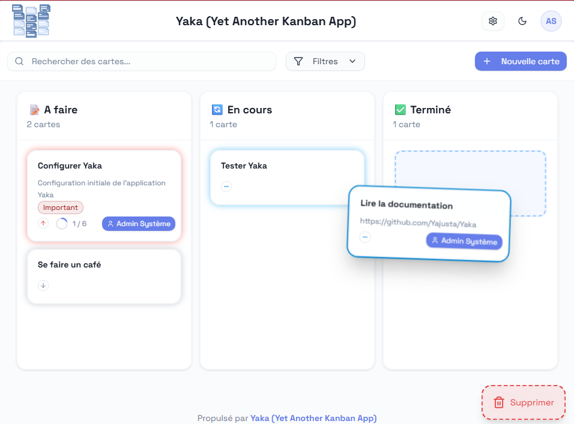
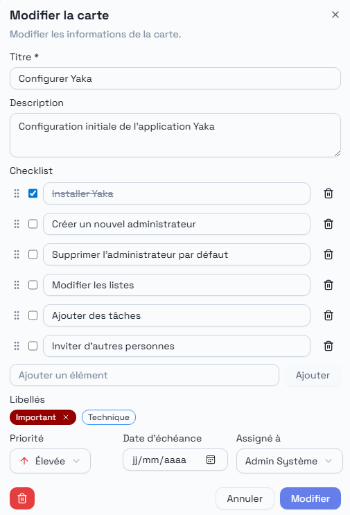

# YAKA - Yet Another Kanban App


Une application web moderne et intuitive pour la gestion collaborative de tâches utilisant la méthodologie Kanban.

## 🖼️ Captures d'écran





## 🖥️ Démo

Pour voir à quoi ressemble cette application avant de l'installer, le plus simple est d'aller tester [la démo](https://yaka-demo.yajusta.fr/).

Identifiant : `admin@yaka.local`
Mot de passe : `admin123`

🗑️ La base est supprimée régulièrement.
⚠️ L'environnement est public : ne mettez pas d'informations sensibles.
L'envoie des emails d'invation est désactivé.

## ⚙️ Fonctionnalités

- **Tableau Kanban interactif**
- **Drag & Drop** fluide pour déplacer les cartes
- **Authentification sécurisée** avec JWT
- **Cartes détaillées** avec titre, description, liste d'éléments, priorité, assigné, libellés, date d'échéance
- **Recherche et filtres**
- **Utilisateurs illimités**
- **Gestion des rôles** (administrateur / membre)
- **Gestion des colonnes** pour mettre autant de colonnes que nécessaire
- **Gestion des libellés** colorés pour la catégorisation

## 🚀 Déploiement

La méthode la plus simple pour utiliser Yaka sans se prendre la tête.

### 1. Cloner le projet

```bash
git clone https://github.com/Yajusta/Yaka.git
cd Yaka
```

### 1. Modifier les variables d'environnement

```bash
cp .env.sample .env
```

### 2. Déployer avec Docker

```bash
docker compose build
docker compose up -d
```

TODO : Faire une image Docker publique qui ne nécessitera pas de cloner le projet.

## 📦 Installation et démarrage

Si vous souhaitez le lancer à la main, c'est possible aussi.

### 📋 Prérequis

- [Python](https://www.python.org/downloads/) 3.12+ + [uv](https://docs.astral.sh/uv/)
- [Node.js](https://nodejs.org/fr/download) 18+
- [pnpm](https://pnpm.io/) (recommandé) ou [npm](https://www.npmjs.com/)

### 1. Cloner le projet

```bash
git clone https://github.com/Yajusta/Yaka.git
cd Yaka
```

### 2. Configuration du serveur de mail

Copier / coller le fichier `.env.sample` en `.env` et remplir les paramètres de configuration de votre serveur SMTP/

Exemple :

```txt
# Paramètres pour l'envoi de mail
SMTP_HOST = "smtp.resend.com"
SMTP_PORT = 587
SMTP_USER = "resend"
SMTP_PASS = "re_xxxxxxxxxxxx"
SMTP_SECURE = "starttls"  # values: 'ssl'|'starttls'|'none'
SMTP_FROM = "no-reply@domain.com"
```

### 3. Démarrage du backend

```bash
cd backend
uv run uvicorn app.main:app --reload
```

Un environnement virtuel sera automatiquement créé avec toutes les dépendances nécessaires.
Le backend sera accessible sur <http://localhost:8000>

### 4. Démarrage du frontend

```bash
cd frontend
pnpm install
pnpm run dev
```

Le frontend sera accessible sur <http://localhost:5173>

## 👤 Compte administrateur par défaut

Un compte administrateur est créé automatiquement lors de l'initialisation :

- **Email :** `admin@kyaka.local`
- **Mot de passe :** `admin123`

Une fois connecté, créez un nouvel administrateur avec votre email puis supprimez ce compte par défaut.

## 📖 Documentation

- [Guide technique du frontend](docs/frontend-technical-documentation.md) - Documentation complète du frontend
- [Guide technique du backend](docs/backend-technical-documentation.md) - Documentation complète du backend
- [Guide Utilisateur](docs/user-guide.md) - Manuel d'utilisation de l'application

## 📄 Licence

Ce projet est sous licence **Non-Commercial License** : vous pouvez utiliser et modifier l'application, mais sans en rendre son utilisation payante sans l'accord de l'auteur.

## 🆘 Support

Pour toute question ou problème :

1. Consulter la [documentation](docs/)
2. Vérifier les [issues existantes]([../../issues](https://github.com/Yajusta/Yaka/issues))
3. Créer une nouvelle issue si nécessaire

## 🔄 Roadmap hypothétique

- [ ] Notifications en temps réel (websockets)
- [ ] Commentaires sur les cartes
- [ ] Pièces jointes
- [ ] Rapports et analytics
- [ ] API publique
- [ ] Intégrations tierces (Slack, Teams, etc.)

## 🛠️ Technologies

### Backend

- **FastAPI** - Framework web Python moderne et performant
- **SQLAlchemy** - ORM pour la gestion de base de données
- **SQLite** - Base de données embarquée
- **JWT** - Authentification par tokens
- **Pydantic** - Validation et sérialisation des données

### Frontend

- **React** - Bibliothèque JavaScript pour l'interface utilisateur
- **shadcn/ui** - Composants UI modernes et accessibles
- **Tailwind CSS** - Framework CSS utility-first
- **Vite** - Outil de build rapide
