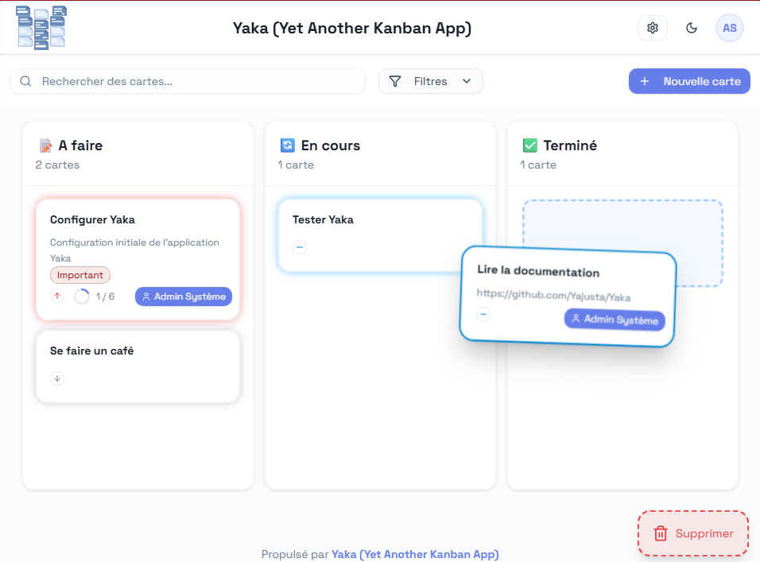
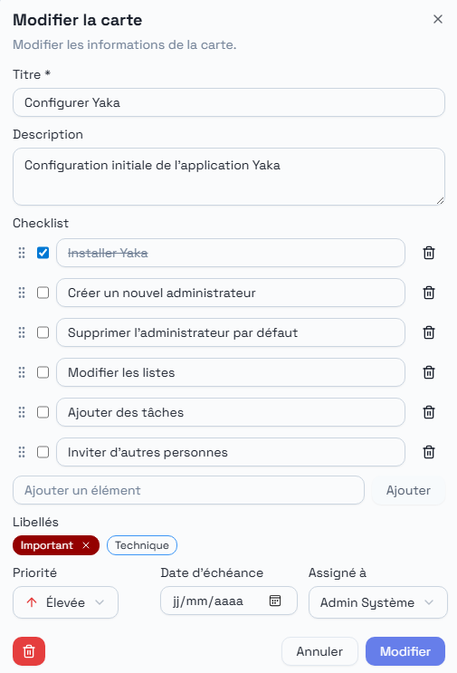

# YAKA - Yet Another Kanban App

[FRANÇAIS](README.fr.md) - **ENGLISH**


A modern and intuitive web application for collaborative task management using the Kanban methodology.

NEW: **Voice control**
Manage your tasks with your voice using natural language thanks to the power of AI.

## 🖼️ Screenshots





## 🖥️ Demo

To see what this application looks like before installing it, the easiest way is to try [the demo](https://yaka-demo.yajusta.fr/).

Username: `admin@yaka.local`
Password: `Admin123`

🗑️ The database is regularly deleted.
⚠️ The environment is public: do not put sensitive information.
Email invitation sending is disabled.

## ⚙️ Features

- **Interactive Kanban Board**
- **Manage tasks with your voice with AI**
- **Drag & Drop** for moving cards smoothly
- **Secure Authentication** with JWT
- **Detailed Cards** with title, description, checklist, priority, assignee, labels, due date, comments
- **Search and filters**
- **Unlimited Users**
- **Role Management** (administrator / member)
- **Column Management** to add as many columns as needed
- **Colored Label Management** for categorization
- **Event History** to track who did what
- **Archive Management** to never lose anything

## 📝 Changelog

[Changelog](CHANGELOG.md)

## 🚀 Deployment

The simplest method to use Yaka without hassle.

### 1. Clone the project

```bash
git clone https://github.com/Yajusta/Yaka.git
cd Yaka
```

### 2. Modify environment variables

```bash
cp .env.sample .env
```

And fill in the necessary environment variables.

### 3. Give the data directory to the container user

The backend container runs as the unprivileged uid `10001`, and `./data/` is bind-mounted into it. That directory (and everything in it) must belong to that uid, otherwise SQLite opens the board databases read-only and any write fails with `sqlite3.OperationalError: attempt to write a readonly database`.

```bash
mkdir -p data
sudo chown -R 10001:10001 data/
```

The directory itself matters as much as the `.db` files: SQLite writes `-journal`/`-wal` siblings, and provisioning a new board creates a new file.

### 4. Deploy with Docker

```bash
docker compose build
docker compose up -d
```

### 5. Update an existing instance

```bash
docker compose down
docker compose build
docker compose up -d
```

TODO: Create a public Docker image that won't require cloning the project.

## 📦 Installation and startup

If you want to run it manually, that's possible too.

### 📋 Prerequisites

- [Python](https://www.python.org/downloads/) 3.12+ + [uv](https://docs.astral.sh/uv/)
- [Node.js](https://nodejs.org/download) 18+
- [pnpm](https://pnpm.io/) (recommended) or [npm](https://www.npmjs.com/)

### 1. Clone the project

```bash
git clone https://github.com/Yajusta/Yaka.git
cd Yaka
```

### 2. Mail server configuration

Copy/paste the `.env.sample` file to `.env` and fill in the configuration parameters for your SMTP server.

Example:

```txt
# Parameters for email sending
SMTP_HOST = "smtp.resend.com"
SMTP_PORT = 587
SMTP_USER = "resend"
SMTP_PASS = "re_xxxxxxxxxxxx"
SMTP_SECURE = "starttls"  # values: 'ssl'|'starttls'|'none'
SMTP_FROM = "no-reply@domain.com"
```

### 3. (optional) AI endpoint

The LLM model that will be used to analyze natural language requests.
Leave empty to disable the feature.

```txt
## AI features (leave empty to disable)
OPENAI_API_KEY=sk-proj-bim-bam-boum
OPENAI_API_BASE_URL=https://api.openai.com/v1
LLM_MODEL=gpt-5-nano
MODEL_TEMPERATURE=
```

### 4. Start the backend

```bash
cd backend
uv run uvicorn app.main:app --reload
```

A virtual environment will be automatically created with all necessary dependencies.
The backend will be accessible at <http://localhost:8000>

### 5. Start the frontend

```bash
cd frontend
pnpm install
pnpm run dev
```

The frontend will be accessible at <http://localhost:5173>

## 👤 Default administrator account

An administrator account is automatically created during initialization:

- **Email:** `admin@kyaka.local`
- **Password:** `Admin123`

Once connected, **create a new administrator** with your email then **delete this default account**.

## 📖 Documentation

- [Frontend Technical Guide](docs/frontend-technical-documentation.md) - Complete frontend documentation
- [Backend Technical Guide](docs/backend-technical-documentation.md) - Complete backend documentation
- [User Guide](docs/user-guide.md) - Application user manual

## 📄 License

This project is under **Non-Commercial License**: you can use and modify the application, but without making its use paid without the author's agreement.

## 🆘 Support

For any questions or problems:

1. Consult the [documentation](docs/)
2. Check [existing issues](https://github.com/Yajusta/Yaka/issues)
3. Create a new issue if necessary

## 🔄 Hypothetical Roadmap

- [ ] Real-time notifications (websockets)
- [ ] Attachments
- [ ] Reports and analytics
- [ ] Public API
- [ ] Third-party integrations (Slack, Teams, etc.)

## 🛠️ Technologies

### Backend

- **FastAPI** - Modern and performant Python web framework
- **SQLAlchemy** - ORM for database management
- **SQLite** - Embedded database
- **JWT** - Token authentication
- **Pydantic** - Data validation and serialization

### Frontend

- **React** - JavaScript library for user interface
- **shadcn/ui** - Modern and accessible UI components
- **Tailwind CSS** - Utility-first CSS framework
- **Vite** - Fast build tool
