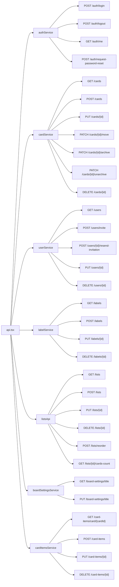
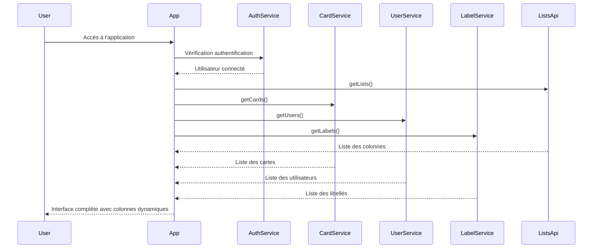
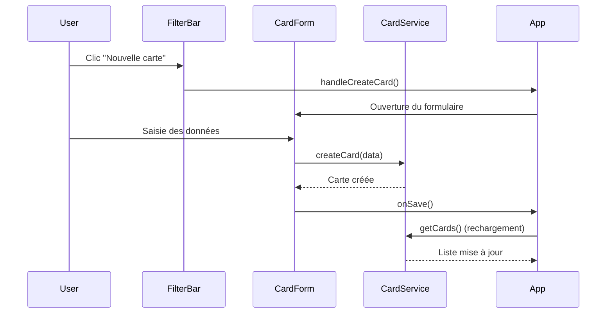
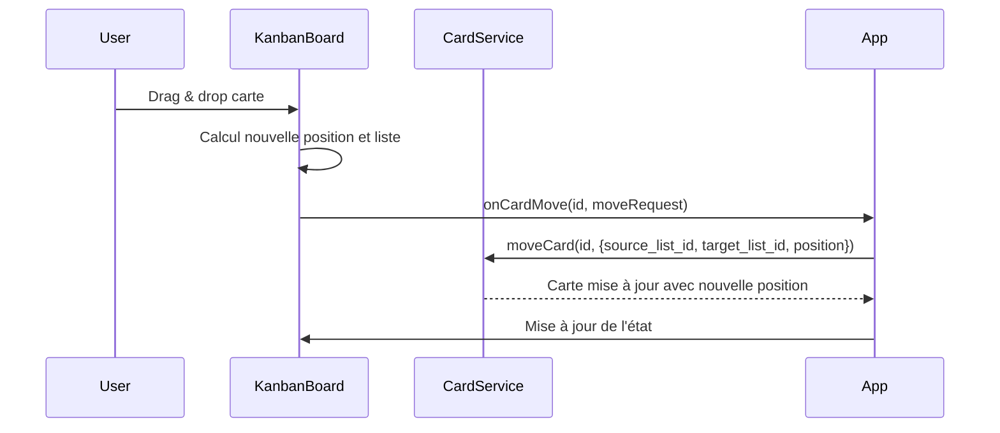
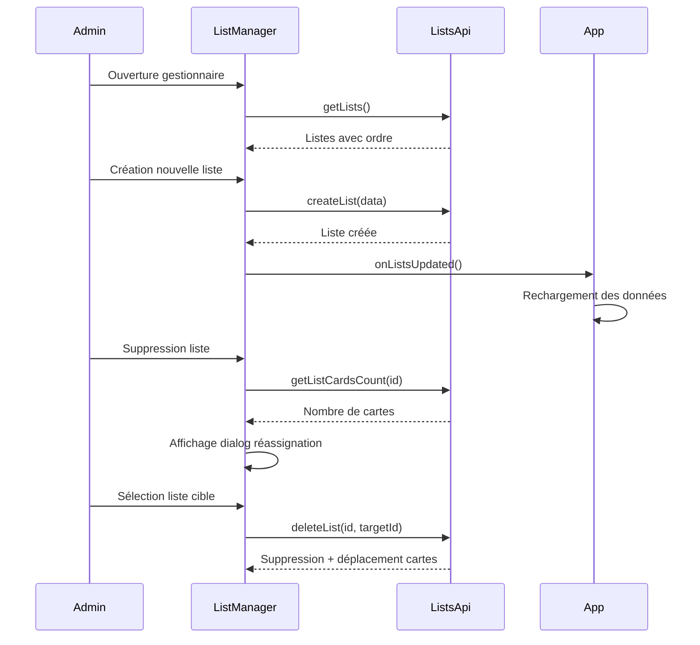

# Documentation technique du Frontend - Application Kanban

## Vue d'ensemble

Cette documentation décrit l'architecture technique du frontend de l'application Kanban, développée en React avec TypeScript. L'application utilise une architecture moderne basée sur des composants réutilisables, une gestion d'état centralisée et des colonnes paramétrables par l'administrateur. L'application supporte également un mode démo avec réinitialisation automatique des données.

## Architecture générale

1. App

    ```mermaid
    graph TB
        A[App.tsx] --> B[Router]
        B --> C[AuthProvider]
        C --> D[BoardSettingsProvider]
        D --> E[UsersProvider]
        E --> F[AppContent]

        F --> G[KanbanApp]
        G --> H[Header]
        G --> I[FilterBar]
        G --> J[KanbanBoard]
        G --> K[CardForm]
        G --> L[LabelManager]
        G --> M[UsersManager]
        G --> N[ListManager]
        G --> O[InterfaceDialog]

        B --> P[InvitePage]

        J --> Q[KanbanColumn]
        Q --> R[CardItem]
    ```

2. API Services

    ```mermaid
    graph TB
        S[API Services] --> T[authService]
        S --> U[cardService]
        S --> V[userService]
        S --> W[labelService]
        S --> X[listsApi]
        S --> Y[boardSettingsService]
        S --> Z[cardItemsService]
    ```

3. Hooks

    ```mermaid
    graph TB
        AA[Hooks] --> AB[useAuth]
        AA --> AC[useTheme]
        AA --> AD[useToast]
        AA --> AE[useElasticTransition]
        AA --> AF[useBoardSettings]
        AA --> AG[useUsers]
    ```

## Structure des composants

### 1. Composant racine (App.tsx)

**Rôle** : Point d'entrée principal avec système de routing et gestion des providers
**Structure** :

- Router (React Router) avec routes protégées et publiques
- AuthProvider pour l'authentification
- BoardSettingsProvider pour les paramètres du tableau
- UsersProvider pour la gestion des utilisateurs

**Routes** :

- `/` : Application Kanban (protégée)
- `/invite` : Page d'invitation (publique)

**Composants enfants** :

- AuthProvider, BoardSettingsProvider, UsersProvider
- KanbanApp (composant principal)
- InvitePage (route publique)

### 2. Application Kanban (KanbanApp)

**Rôle** : Composant principal contenant toute la logique métier de l'application
**Endpoints appelés** :

- `GET /cards` (via `cardService.getCards`)
- `GET /users` (via `userService.getUsers`)
- `GET /labels` (via `labelService.getLabels`)
- `PATCH /cards/{id}/archive` (via `cardService.archiveCard`)
- `PATCH /cards/{id}/move` (via `cardService.moveCard`)

**Composants enfants** :

- Header
- FilterBar
- KanbanBoard
- CardForm
- LabelManager
- UsersManager
- ListManager (admin uniquement)
- InterfaceDialog

**État géré** :

- `allCards`: Liste complète des cartes
- `cards`: Cartes filtrées
- `users`: Liste des utilisateurs
- `labels`: Liste des libellés
- `filters`: Filtres actifs
- `showCardForm`: Affichage du formulaire de carte
- `editingCard`: Carte en cours d'édition
- `showListManager`: Affichage du gestionnaire de listes (admin)
- `showUsersManager`: Affichage du gestionnaire d'utilisateurs
- `showLabelManager`: Affichage du gestionnaire de libellés
- `showInterfaceDialog`: Affichage de la boîte de dialogue d'interface

### 2. Authentification

#### LoginForm.tsx

**Rôle** : Formulaire de connexion utilisateur
**Endpoints appelés** :

- `POST /auth/login` (via `authService.login`)

**Composants UI utilisés** :

- Button, Input, Label, Card, Alert

#### InvitePage.tsx

**Rôle** : Page d'invitation pour nouveaux utilisateurs
**Endpoints appelés** :

- `POST /users/invite` (via `userService.inviteUser`)

**Composants UI utilisés** :

- Button, Input, Label, Card

#### useAuth.tsx (Hook)

**Rôle** : Gestion de l'état d'authentification
**Endpoints appelés** :

- `POST /auth/login`
- `POST /auth/logout`
- `GET /auth/me`
- `POST /auth/request-password-reset`

**Fonctionnalités** :

- État de connexion utilisateur
- Gestion du token JWT
- Persistance dans localStorage
- Redirection automatique après expiration
- Fonctions de login/logout

### 3. Interface principale

#### Header.tsx

**Rôle** : Barre de navigation et actions utilisateur
**Endpoints appelés** : Aucun (utilise les données du contexte)

**Fonctionnalités** :

- Affichage des informations utilisateur
- Basculement de thème
- Accès aux gestionnaires (utilisateurs, libellés, listes)
- Déconnexion
- Menu admin avec accès au gestionnaire de listes

**Composants UI utilisés** :

- Button, DropdownMenu, Avatar, GlassmorphicCard

#### FilterBar.tsx

**Rôle** : Barre de filtres et création de cartes
**Endpoints appelés** : Aucun (utilise les données passées en props)

**Fonctionnalités** :

- Recherche textuelle
- Filtrage par assigné, priorité, libellé
- Bouton de création de carte
- Affichage des filtres actifs

**Composants UI utilisés** :

- Button, Input, Select, Badge, GlassmorphicCard

### 4. Tableau Kanban

#### KanbanBoard.tsx

**Rôle** : Conteneur principal du tableau Kanban avec drag & drop et colonnes dynamiques
**Endpoints appelés** :

- `GET /lists` (via `listsApi.getLists`)
- `PATCH /cards/{id}/move` (via `onCardMove`)
- `PATCH /cards/{id}/archive` (via `onCardDelete`)

**Fonctionnalités** :

- Gestion du drag & drop avec @dnd-kit
- Chargement dynamique des listes/colonnes
- Calcul des positions de drop avec gestion des positions
- Animation élastique des cartes
- Zone de suppression (trash)
- Défilement horizontal pour les nombreuses colonnes
- Gestion responsive des colonnes

**Composants enfants** :

- KanbanColumn (dynamique selon les listes configurées)
- TrashZone

#### KanbanColumn.tsx

**Rôle** : Colonne individuelle du tableau Kanban basée sur une liste paramétrable
**Endpoints appelés** : Aucun (délègue aux callbacks)

**Props reçues** :

- `list`: Objet KanbanList avec id, nom, ordre
- `cards`: Cartes filtrées pour cette liste
- `onCardUpdate`, `onCardDelete`, `onCardMove`: Callbacks

**Fonctionnalités** :

- Affichage des cartes par list_id
- Titre dynamique basé sur le nom de la liste
- Gestion des placeholders de drop avec positions
- Animations de transition élastique
- Support du défilement vertical

**Composants enfants** :

- CardItem (multiple)

#### CardItem.tsx

**Rôle** : Carte individuelle draggable
**Endpoints appelés** : Aucun (délègue aux callbacks)

**Fonctionnalités** :

- Affichage des informations de la carte
- Actions d'édition et suppression
- Support du drag & drop
- Affichage des libellés, priorité, assigné

**Composants UI utilisés** :

- CardContent, Badge, Button, Avatar, PriorityBadge, GlassmorphicCard

### 5. Gestion des cartes

#### CardForm.tsx

**Rôle** : Formulaire de création/édition de cartes
**Endpoints appelés** :

- `GET /users` (via `userService.getUsers`)
- `GET /labels` (via `labelService.getLabels`)
- `POST /cards` (via `cardService.createCard`)
- `PUT /cards/{id}` (via `cardService.updateCard`)

**Fonctionnalités** :

- Création de nouvelles cartes
- Édition de cartes existantes
- Sélection d'assigné et libellés
- Validation des données

**Composants UI utilisés** :

- Dialog, Input, Textarea, Select, Badge, Button

### 6. Gestion des utilisateurs

#### UsersManager.tsx

**Rôle** : Interface d'administration des utilisateurs
**Endpoints appelés** :

- `GET /users` (via `userService.getUsers`)
- `POST /users/invite` (via `userService.inviteUser`)
- `DELETE /users/{id}` (via `userService.deleteUser`)

**Fonctionnalités** :

- Liste des utilisateurs
- Invitation de nouveaux utilisateurs
- Suppression d'utilisateurs
- Gestion des rôles

**Composants UI utilisés** :

- Dialog, Input, Button

### 6. Gestion des libellés

#### LabelManager.tsx

**Rôle** : Interface d'administration des libellés
**Endpoints appelés** :

- `GET /labels` (via `labelService.getLabels`)
- `POST /labels` (via `labelService.createLabel`)
- `PUT /labels/{id}` (via `labelService.updateLabel`)
- `DELETE /labels/{id}` (via `labelService.deleteLabel`)

**Fonctionnalités** :

- Liste des libellés
- Création de nouveaux libellés
- Édition de libellés existants
- Suppression de libellés
- Sélecteur de couleur

**Composants UI utilisés** :

- Dialog, Input, Card, Badge, Button

### 7. Gestion des listes (Admin uniquement)

#### ListManager.tsx

**Rôle** : Interface d'administration des colonnes Kanban paramétrables
**Endpoints appelés** :

- `GET /lists` (via `listsApi.getLists`)
- `POST /lists` (via `listsApi.createList`)
- `PUT /lists/{id}` (via `listsApi.updateList`)
- `DELETE /lists/{id}` (via `listsApi.deleteList`)
- `POST /lists/reorder` (via `listsApi.reorderLists`)
- `GET /lists/{id}/cards-count` (via `listsApi.getListCardsCount`)

**Fonctionnalités** :

- Liste des colonnes avec ordre d'affichage
- Création de nouvelles colonnes
- Édition des noms de colonnes
- Suppression de colonnes avec réassignation des cartes
- Réorganisation par drag & drop
- Validation des contraintes (minimum 1 liste)
- Gestion des cartes lors de la suppression

**Composants UI utilisés** :

- Dialog, Input, Card, Button, Select, DndContext, SortableContext
- Composants de validation et d'erreur personnalisés

**Validation et contraintes** :

- Noms de listes uniques (max 100 caractères)
- Minimum 1 liste obligatoire
- Réassignation obligatoire des cartes lors de suppression
- Permissions admin uniquement

### 8. Paramètres du tableau (Admin uniquement)

#### InterfaceDialog.tsx

**Rôle** : Interface de configuration des paramètres du tableau Kanban
**Endpoints appelés** :

- `GET /board-settings/title` (via `boardSettingsService.getBoardTitle`)
- `PUT /board-settings/title` (via `boardSettingsService.updateBoardTitle`)

**Fonctionnalités** :

- Configuration du titre du tableau
- Paramètres d'interface utilisateur
- Préférences d'affichage

**Composants UI utilisés** :

- Dialog, Input, Button, Card

## Services API

### Structure des services



### Détail des endpoints

#### authService

- **login(email, password)** → `POST /auth/login`
- **logout()** → `POST /auth/logout`
- **getCurrentUser()** → `GET /auth/me`

#### cardService

- **getCards(filters)** → `GET /cards?search=...&assignee_id=...&list_id=...`
- **createCard(cardData)** → `POST /cards`
- **updateCard(id, cardData)** → `PUT /cards/{id}`
- **moveCard(id, moveRequest)** → `PATCH /cards/{id}/move`
- **archiveCard(id)** → `PATCH /cards/{id}/archive`
- **deleteCard(id)** → `DELETE /cards/{id}`

#### userService

- **getUsers()** → `GET /users`
- **inviteUser(userData)** → `POST /users/invite`
- **deleteUser(id)** → `DELETE /users/{id}`

#### labelService

- **getLabels()** → `GET /labels`
- **createLabel(labelData)** → `POST /labels`
- **updateLabel(id, labelData)** → `PUT /labels/{id}`
- **deleteLabel(id)** → `DELETE /labels/{id}`

#### listsApi

- **getLists(useCache)** → `GET /lists`
- **createList(listData)** → `POST /lists`
- **getList(id)** → `GET /lists/{id}`
- **updateList(id, listData)** → `PUT /lists/{id}`
- **deleteList(id, targetListId)** → `DELETE /lists/{id}`
- **reorderLists(listOrders)** → `POST /lists/reorder`
- **getListCardsCount(id)** → `GET /lists/{id}/cards-count`

#### boardSettingsService

- **getBoardTitle()** → `GET /board-settings/title`
- **updateBoardTitle(title)** → `PUT /board-settings/title`

#### cardItemsService

- **getItems(cardId)** → `GET /card-items/card/{cardId}`
- **createItem(cardId, texte, position?, is_done)** → `POST /card-items`
- **updateItem(itemId, data)** → `PUT /card-items/{itemId}`
- **deleteItem(itemId)** → `DELETE /card-items/{itemId}`

## Hooks personnalisés

### useAuth

**Rôle** : Gestion de l'authentification
**Fonctionnalités** :

- État de connexion utilisateur
- Gestion du token JWT
- Persistance dans localStorage
- Redirection automatique après expiration
- Fonctions de login/logout
- Gestion des erreurs d'authentification

### useTheme

**Rôle** : Gestion du thème clair/sombre
**Fonctionnalités** :

- Basculement entre thèmes
- Persistance des préférences
- Application des classes CSS
- Support du thème système

### useElasticTransition

**Rôle** : Animations élastiques pour le drag & drop
**Fonctionnalités** :

- Calcul des positions d'animation
- Gestion des transitions fluides
- Optimisation des performances

### useBoardSettings

**Rôle** : Gestion des paramètres du tableau Kanban
**Fonctionnalités** :

- Récupération des paramètres du tableau
- Mise à jour du titre du tableau
- Cache des paramètres

### useUsers

**Rôle** : Gestion des utilisateurs avec cache
**Fonctionnalités** :

- Récupération des utilisateurs avec cache TTL
- Invalidation automatique du cache
- Gestion des erreurs de chargement

## Flux de données

### Chargement initial



### Création d'une carte



### Déplacement d'une carte



### Gestion des listes (Admin)



## Types de données

### Interfaces principales

```typescript
interface User {
    id: number;
    username: string;
    email: string;
    display_name?: string;
    role?: string;
    created_at: string;
    updated_at: string;
}

interface KanbanList {
    id: number;
    name: string;
    order: number;
    created_at: string;
    updated_at: string;
}

interface Card {
    id: number;
    titre: string;
    description: string;
    priorite: string;
    assignee_id: number | null;
    list_id: number;  // Remplace 'statut'
    position: number; // Nouvelle propriété pour l'ordre
    date_echeance?: string;
    assignee?: User;
    labels?: Label[];
    kanban_list?: KanbanList;
    created_at: string;
    updated_at: string;
}

interface Label {
    id: number;
    nom: string;
    couleur: string;
    created_at: string;
    updated_at: string;
}

interface CardMoveRequest {
    source_list_id: number;
    target_list_id: number;
    position?: number;
}

interface KanbanListCreate {
    name: string;
    order: number;
}

interface KanbanListUpdate {
    name?: string;
    order?: number;
}

interface ListWithCardCount {
    list: KanbanList;
    card_count: number;
}
```

## Gestion d'état

### État global (App.tsx)

- **cards** : Liste complète des cartes avec positions
- **users** : Liste des utilisateurs
- **labels** : Liste des libellés
- **lists** : Liste des colonnes Kanban paramétrables
- **filters** : Filtres actifs pour les cartes

### État local des composants

- **CardForm** : Données du formulaire, validation, sélection de liste
- **KanbanBoard** : État du drag & drop, animations, listes dynamiques
- **FilterBar** : État des filtres étendus
- **ListManager** : Gestion des listes, validation, réorganisation
- **KanbanColumn** : Cartes filtrées par liste, positions de drop

### Cache et optimisations

- **ListsCache** : Cache intelligent des listes avec invalidation automatique
- **Position tracking** : Gestion précise des positions des cartes
- **Lazy loading** : Chargement conditionnel des données

## Optimisations et performances

### Cache intelligent

- **ListsCache** : Cache des listes avec TTL de 5 minutes
- Invalidation automatique après modifications
- Mise à jour optimiste pour une meilleure UX

### Lazy loading

- Chargement des données uniquement quand nécessaire
- Rechargement sélectif après modifications
- Cache conditionnel avec paramètre `useCache`

### Animations optimisées

- Utilisation de `transform` et `opacity` pour les animations
- Désactivation des scrollbars pendant les animations
- Nettoyage automatique des styles temporaires
- Animations élastiques pour le drag & drop

### Gestion mémoire

- Nettoyage des event listeners
- Utilisation de `useCallback` pour éviter les re-renders
- Gestion optimisée des positions de cartes

### Responsive design

- Défilement horizontal automatique pour nombreuses colonnes
- Largeur adaptative des colonnes (33% pour ≤3, scroll pour >3)
- Interface mobile-friendly pour la gestion des listes

## Sécurité

### Authentification

- Token JWT stocké dans localStorage
- Intercepteur Axios pour l'ajout automatique du token
- Redirection automatique en cas d'expiration

### Autorisation

- **Contrôle d'accès basé sur les rôles** : Seuls les admins peuvent gérer les listes
- Vérification des permissions côté frontend et backend
- Interface conditionnelle selon le rôle utilisateur

### Validation

- **Validation des listes** : Noms uniques, longueur max 100 caractères
- **Contraintes métier** : Minimum 1 liste obligatoire
- **Validation des positions** : Cohérence des positions de cartes
- Validation côté client des formulaires
- Sanitisation des données avant envoi à l'API
- Gestion des erreurs avec messages utilisateur contextuels

## Mode démo

L'application supporte un mode démo permettant de tester toutes les fonctionnalités sans configuration complexe. Ce mode peut être activé via la variable d'environnement `DEMO_MODE=true`.

### Fonctionnalités du mode démo

#### Activation

- **Variable d'environnement** : `DEMO_MODE=true`
- **Détection automatique** : Via `backend/app/utils/demo_mode.py`
- **Configuration** : Peut être défini dans `.env` ou les variables d'environnement système

#### Réinitialisation automatique

- **Endpoint dédié** : `POST /demo/reset`
- **Protection** : Uniquement accessible quand `DEMO_MODE=true`
- **Intervalle configurable** : `DEMO_RESET_INTERVAL_MINUTES` (défaut: 60 minutes)
- **Données de base** : Recréation de l'utilisateur admin et données d'exemple

#### Données de démonstration

- **Utilisateur admin** : `admin@yaka.local`
- **Utilisateurs de test** : Créés automatiquement
- **Colonnes par défaut** : "À faire", "En cours", "Terminé"
- **Cartes d'exemple** : Avec différents statuts et assignations
- **Libellés** : Ensemble de libellés prédéfinis

#### Sécurité de la démo

- **Accès restreint** : L'endpoint de réinitialisation n'est accessible qu'en mode démo
- **Logs informatifs** : Messages de console indiquant le mode actif
- **Protection backend** : Vérification côté serveur du mode démo

### Configuration du mode démo

#### Variables d'environnement

```bash
DEMO_MODE=true
DEMO_RESET_INTERVAL_MINUTES=60
```

#### Fichiers de configuration

- **Backend** : `backend/.env`
- **Frontend** : `frontend/public/demo-config.js`
- **Variables système** : Support des variables d'environnement du système

### Avantages pour le développement

- **Tests rapides** : Environnement de test prêt à l'emploi
- **Démonstrations** : Présentation des fonctionnalités sans configuration
- **Développement** : État connu pour les tests
- **CI/CD** : Environnement reproductible pour les tests automatisés

## Technologies utilisées

### Principales

- **React 19** : Framework principal
- **TypeScript** : Typage statique
- **Vite** : Build tool et dev server
- **Tailwind CSS** : Framework CSS

### Librairies spécialisées

- **@dnd-kit** : Drag & drop
- **Radix UI** : Composants UI accessibles
- **Axios** : Client HTTP
- **Lucide React** : Icônes
- **Framer Motion** : Animations avancées

### Outils de développement

- **ESLint** : Linting du code
- **PostCSS** : Traitement CSS
- **pnpm** : Gestionnaire de paquets

## Fonctionnalités principales

### 1. Colonnes Kanban paramétrables

L'application supporte des colonnes Kanban entièrement paramétrables par les administrateurs, offrant une grande flexibilité dans la gestion des workflows.

#### Architecture des colonnes

- **Modèle de données** : Cartes avec `list_id` (foreign key) et `position` (integer)
- **Interface d'administration** : `ListManager` avec gestion complète des colonnes
- **Drag & drop** : Réorganisation intuitive des colonnes et cartes
- **Validation temps réel** : Contraintes métier et vérifications d'intégrité

#### Fonctionnalités avancées

- **Colonnes dynamiques** : Nombre illimité de colonnes
- **Défilement horizontal** : Interface responsive pour nombreuses colonnes
- **Positions précises** : Gestion fine de l'ordre des cartes
- **Cache intelligent** : Optimisation des performances avec `listsApi`

### 2. Système d'authentification complet

- **JWT Tokens** : Authentification sécurisée avec tokens JWT
- **Gestion des rôles** : Système de permissions basé sur les rôles
- **Invitation d'utilisateurs** : Interface d'invitation avec gestion des rôles
- **Récupération de mot de passe** : Système de réinitialisation sécurisé

### 3. Gestion des utilisateurs et permissions

- **Interface d'administration** : Gestion complète des utilisateurs
- **Contrôle d'accès** : Permissions granulaires par rôle
- **Cache des utilisateurs** : Optimisation avec TTL de 1 minute
- **Gestion des invitations** : Système d'invitation avec réenvoi

### 4. Mode démo intégré

- **Activation simple** : Via variable d'environnement `DEMO_MODE=true`
- **Réinitialisation automatique** : Endpoint dédié avec protection
- **Données de test** : Jeu de données complet pour les démonstrations
- **Configuration flexible** : Intervale configurable pour la réinitialisation

### 5. Interface utilisateur moderne

- **Composants accessibles** : Basés sur Radix UI
- **Design responsive** : Interface mobile-friendly
- **Thèmes supportés** : Clair, sombre, et suivi du thème système
- **Animations fluides** : Drag & drop avec animations élastiques
- **Feedback utilisateur** : Toasts et notifications contextuelles

### 6. Architecture technique robuste

- **Services modulaires** : Séparation claire des responsabilités
- **Gestion d'état optimisée** : Hooks personnalisés avec cache
- **API RESTful** : Endpoints bien structurés avec documentation
- **Gestion d'erreurs** : Messages contextuels et récupération gracieuse
- **Performance optimisée** : Cache, lazy loading, et optimisations mémoire

### 7. Support des checklists (Backend uniquement)

L'application backend supporte les checklists pour les cartes via le service `cardItemsService`, permettant d'ajouter des éléments de tâches aux cartes. Cette fonctionnalité est implémentée côté backend mais n'a pas encore d'interface frontend dédiée.

#### Fonctionnalités disponibles

- **Création d'éléments** : Ajout de tâches aux cartes
- **Suivi d'état** : Marquage des éléments comme terminés/non terminés
- **Positionnement** : Ordre personnalisable des éléments
- **CRUD complet** : Création, lecture, mise à jour, suppression

#### Endpoints API

- `GET /card-items/card/{cardId}` : Récupération des éléments d'une carte
- `POST /card-items` : Création d'un nouvel élément
- `PUT /card-items/{id}` : Mise à jour d'un élément
- `DELETE /card-items/{id}` : Suppression d'un élément

Cette documentation fournit une vue complète de l'architecture frontend moderne, facilitant la maintenance et l'évolution continue de l'application.
